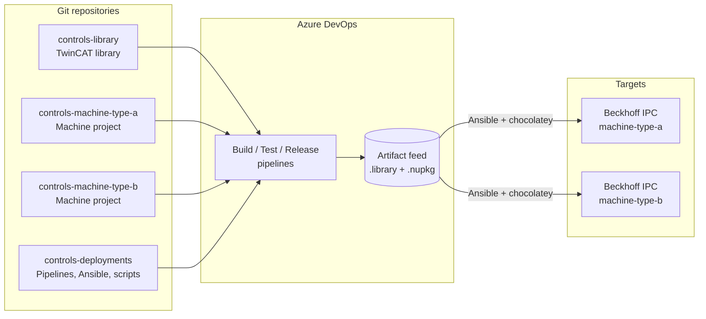

# Controls DevOps

A DevOps workflow for industrial controls built around **Beckhoff TwinCAT 3**, **Azure DevOps**, and **Ansible**.

## Philosophy

At a high level we try to follow similar software development practices as you would follow with any software.

- For each machine type, we have a git repository containing the PLC project.
- For common functionality, we have a git repository containing the shared library code. This uses TwinCAT library functionality.
- For DevOps, we have a single repository that contains all of the code, scripting, and pipeline definitions used across all PLC projects.

## Architecture

## Where to start

-   :material-factory:{ .lg .middle } **TwinCAT 3**

    ---

    Library and project repo layout, git-friendly TwinCAT settings, development process, TcUnit, and project variants.

    [:octicons-arrow-right-24: TwinCAT 3](twincat/index.md)

-   :material-source-branch:{ .lg .middle } **Azure DevOps**

    ---

    Build / test / release pipelines, the deploy pipeline, agents, and example YAML.

    [:octicons-arrow-right-24: Azure DevOps](azure-devops/index.md)

-   :material-server-network:{ .lg .middle } **Ansible**

    ---

    The deployment repository, what Ansible manages, and PLC code deployment via chocolatey.

    [:octicons-arrow-right-24: Ansible](ansible/index.md)

-   :material-lightbulb-on-outline:{ .lg .middle } **Retrospective**

    ---

    What works well, what could be improved.

    [:octicons-arrow-right-24: Retrospective](retrospective.md)

## How to this document to quickly scaffold a framework

With modern AI agentic tooling and a plugin like [superpowers](https://github.com/obra/superpowers) you should be able to quickly scaffold a framework that works for your company and the tools that your company uses:

> Hey agent, review the documentation in this repository, then help me to brainstorm how to implement this for my company. For each feature that is suggested, walk me through what I need to set up. Instead of Azure DevOps, suggest how I can implement this with Gitlab. Help me to build the CLI tool for TwinCAT using .NET 10. For each feature, research the best practices and documentation before suggesting an approach, for example, review Beckhoff's infosys for documentation on Automation Interface before suggesting how to implement the CLI.