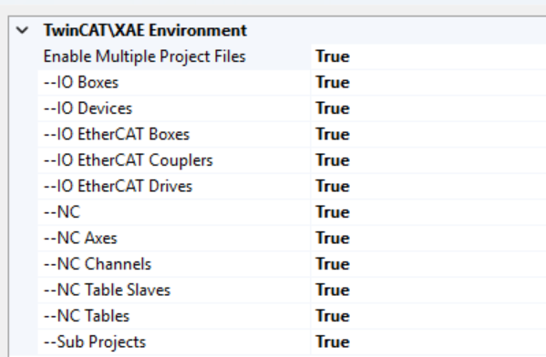
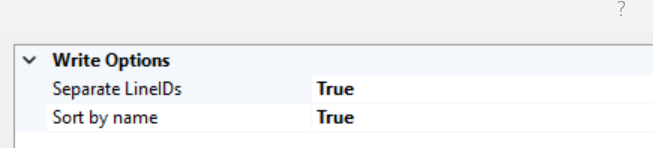
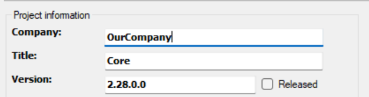
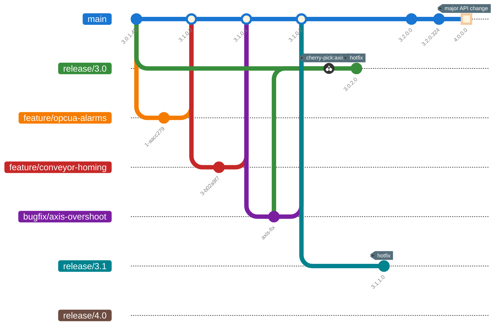
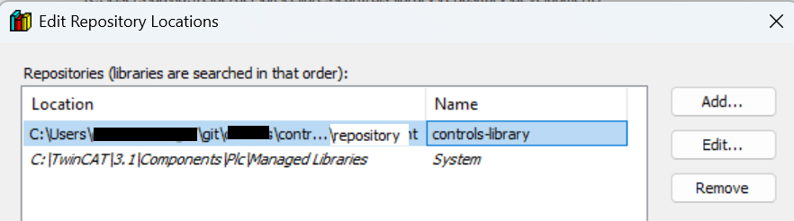
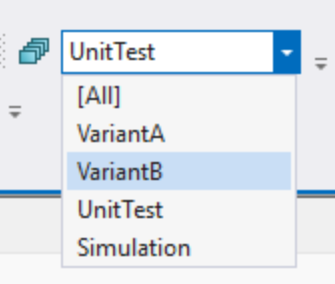
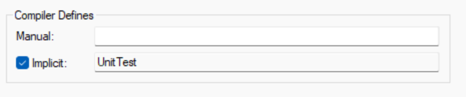

# TwinCAT 3

Project structure, git-friendly TwinCAT settings, and the development process for Beckhoff TwinCAT 3 code.

## Repository layout: `controls-library`

The `controls-library` repo contains shared TwinCAT library code used by machine projects.

```text
controls-library/
├── repository/                   # TwinCAT library repository (auto-generated by TwinCAT)
│   ├── OurCompany/
│   │   ├── Core/
│   │   │   ├── 1.0.0.0/
│   │   │   │   ├── browsercache
│   │   │   │   ├── Core.library
│   │   │   │   ├── dependencies
│   │   │   │   └── projectinfo
│   │   │   ├── 1.0.1.0/
│   │   │   └── 1.0.2.0/
│   │   ├── Errors/
│   │   └── …
│   ├── www.tcunit.org/
│   │   └── TcUnit/
│   │       ├── 1.1.0.0/
│   │       └── 1.2.0.0/
│   └── cache
├── docs/                         # Auto-generated documentation
│   ├── Core/
│   └── Errors/
├── src/                          # TwinCAT library projects
│   ├── Core/                     # A TwinCAT library project
│   │   ├── Common/
│   │   │   ├── FB_Step
│   │   │   ├── FB_EquipmentModule
│   │   │   └── …
│   │   ├── Components/
│   │   │   ├── FB_Actuator
│   │   │   ├── FB_Axis
│   │   │   └── …
│   │   └── Test/
│   │       ├── FB_ActuatorTestSuite.TcPOU
│   │       ├── FB_EquipmentModuleTestSuite.TcPOU
│   │       └── PRG_Test.TcPOU
│   ├── Errors/                   # Another TwinCAT library project
│   └── Library.sln
├── tools/                        # Scripting utilities imported into other projects (e.g. doc generation)
├── .gitignore
├── .pre-commit-config.yaml
└── dependencies.txt
```

## Repository layout: `controls-machine-type-a`

One repo per machine type.

```text
controls-machine-type-a/
├── config/                       # ESI file exports and startup parameters
│   ├── ethercat/
│   │   ├── startup
│   │   └── esi
│   └── nc
├── docs/
│   ├── MachineTypeAVersion1/     # Auto-generated documentation
│   └── MachineTypeAVersion2/
├── projects/
│   ├── MachineTypeAVersion1/     # Top-level product version (maps to one or more part numbers)
│   │   ├── MachineTypeAVersion1.sln
│   │   └── MachineTypeAVersion1/
│   │       ├── _Config/          # Independent Project Files so I/O modules show up as .xti files
│   │       ├── SimIO/            # Virtual commissioning / digital twin (e.g. Process Simulate, iPhysics, etc)
│   │       ├── MainPLC/
│   │       │   ├── MAIN.TcPOU
│   │       │   ├── PlcTask.TcTTO
│   │       │   ├── PlcTaskFast.TcTTO
│   │       │   ├── MainPLC.plcproj
│   │       │   └── …
│   │       ├── SafetyPLC/
│   │       │   ├── Hashes.shv    # Enables automatic hash generation for comparing the safety project
│   │       │   └── Safety.splcproj
│   │       └── MachineTypeAVersion1.tsproj
│   └── MachineTypeAVersion2/
│       └── …                     # Repeat structure
├── tests/                        # VC ("integration") tests using pytest
│   ├── MachineTypeAVersion1/
│   └── MachineTypeAVersion2/
└── .gitignore
```

## TwinCAT setup to work well with Git

### Enable Independent Project Files

Makes changes to I/O much easier to understand.



### Enable Separate LineIDs and Sort by name



### Enable "Minimize Id changes in TwinCAT files"


### Give every PLC project a version



### References

- [Beckhoff source control whitepaper](https://download.beckhoff.com/download/document/automation/twincat3/tc3_sourcecontrol_en.pdf)
- [Source control tips for TwinCAT](https://github.com/Roald87/TwincatSourceControl)

## Development process

### Versioning

I explored a few methods for versioning and git workflows, but settled on Trunk-Based Development using branches for release. It's easy to reason about compared to more complicated workflows like gitflow, and it works well for factories where you have equipment that may stay on a single version for a long time and still needs to be supported (the release branches), while also supporting continual improvement on the main branch. See <https://trunkbaseddevelopment.com/> for a great overview, and specifically <https://trunkbaseddevelopment.com/branch-for-release/>.

We use a four-part version number. The first three parts follow [semver](https://semver.org/) - MAJOR breaks interface or behavior, MINOR adds features, PATCH is a hotfix from a release branch. The fourth part is a BUILD counter we increment on every change to main, so prototype machines in the field can be identified precisely.

In our workflow, machine PLC projects have the latest version on the main (trunk) branch. This is where the newest features are available. As developers make changes, they increment the "increment" or "build" version, e.g. `3.2.0.17` becomes `3.2.0.18`. Some companies don't specify a version for the main branch, or they specify a date or some other number, since it isn't an official release. We found it easiest to just increment the last digit, that way it is slightly easier to tell what is on different prototype machines in the field.

The version we're talking about is the one set on each PLC project (see [Give every PLC project a version](#give-every-plc-project-a-version) above); the [build / test / release pipeline](../azure-devops/index.md#build-test-release-pipelines) reads it when it cuts a package.

When we want to cut a release, we follow this workflow:

1. Create a branch off of main. This becomes the release branch. Let's say main is on `3.0.1.45`, then there is now a `release/3.0` branch.
2. Increment the main version, e.g. make a commit into main that updates the PLC project version to `3.1.0.0`.
3. Create a package from the `release/3.0` branch. The first version is going to be `3.0.1.45`.
4. Deploy version `3.0.1.45` to your machines.

#### Hot-fix workflow

Let's say we have a hotfix we need to make. The ideal scenario:

1. Fix the bug on the main branch. Let's say main was on `3.1.0.1`. Now it becomes `3.1.0.2`.
2. Cherry-pick the fix into the release branches. Fixes always flow **forward from main into `release/*`**, never the other way around - that keeps main the source of truth for every bug that exists across any release.
3. Let's say you want to update `3.0` with the hotfix. Bring the fix into the `release/3.0` branch, and increment the PATCH digit. So `3.0.1.45` becomes `3.0.2.0`.
4. Create a package from the release branch, with version `3.0.2.0`.
5. Deploy it.

The bigger picture - features and bugfixes merging into main, multiple release branches peeled off at different points, a cherry-picked hotfix, and a major version bump:



#### Release notes

This versioning workflow works well when you have many similar machines, sharing the same PLC project (but maybe with different variants). You can deploy new versions, and everyone in the company that is working with the machine can know what is on that version. You can create release notes and share these with stakeholders like production and quality.

#### Libraries

The same workflow applies to libraries in principle, but for our libraries we just have all projects pointed at the main branch of each library. So unless you are developing a library-specific feature, you would just update your `controls-library` repo by performing `git pull` to get the latest changes.

We can get away with that for a few reasons:

- TwinCAT's Library Repository already keeps the compiled version of every library side-by-side (see the `1.0.0.0/`, `1.0.1.0/`, `1.0.2.0/` folders in the [repo layout](#repository-layout-controls-library) above). A machine project pinned to `Core 1.0.1.0` is already its own "release".
- It's simpler - people don't need to know which release branch of a library they need to be on.
- We make sure library versions follow semver, so there's room from a versioning perspective to fix an issue in a library. In practice this isn't done, though - you either stay on one version of a library for a long time, or you upgrade and address any breaking changes.

#### Deployment Commands

TwinCAT lets you hook batch commands into project-lifecycle events (download, after compile, online change); these are called [*Deployment Commands*](https://infosys.beckhoff.com/english.php?content=../content/1033/tc3_plc_intro/3260050187.html&id=). We use them to copy git metadata - commit hash, author, date, and branch - into the PLC project at build time (exposed as a text file that can be ready by the PLC project). Because that information is included in the PLC boot directory, it can surface on the HMI.

The payoff is field debugging: you can tell at a glance which commit is actually running on a given machine, whether it matches what should be there, and who to ask about it. 


### Library development

For a new library version, the developer branches off of `main`, makes their changes, increments the project version, and "Save as Library" into the `controls-library/repository` folder on the development branch. When the branch is merged into `main`, the library is available to other machine projects as long as the developer has pulled `main` for their copy of `controls-library`.

!!! info
    When we came up with this scheme, [twinpack](https://github.com/Zeugwerk/Twinpack) wasn't available, but we would probably switch to that if starting from scratch.



#### Build validation

The library project contains a Test program using TcUnit. The developer can run tests locally using the Usermode Runtime or on physical hardware. When the developer wants to merge their changes into `main`, they create a PR. Build validation is set up on the PR that will check:

- That the version has been incremented
- Run unit tests using the correct test pipeline (e.g. `test_core_library.yml`)

### Machine development

For a new machine code version, the developer branches off of `main`, makes their changes, and increments the project version.

#### Build validation

The machine project *may* contain a Test program using TcUnit. If it does, this can be selected using project variants. Below shows an example where there is a `UnitTest` variant.



In the program, unit test logic is only called if this variant is selected, using the implicit variant macro that is generated.



```pascal
PROGRAM MAIN
VAR
    {IF defined(UnitTest)}
    tests : FB_Tests;
    {END_IF}
END_VAR

{IF defined(UnitTest)}
tests();
{END_IF}
```

!!! info
    We found the best success developing unit tests for library function blocks (re-usable code), and using integration tests with virtual commissioning tools for machine projects.
